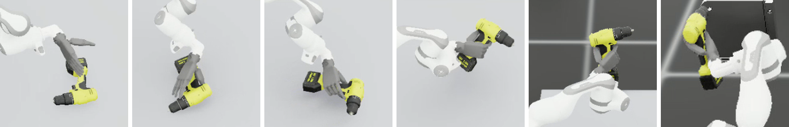
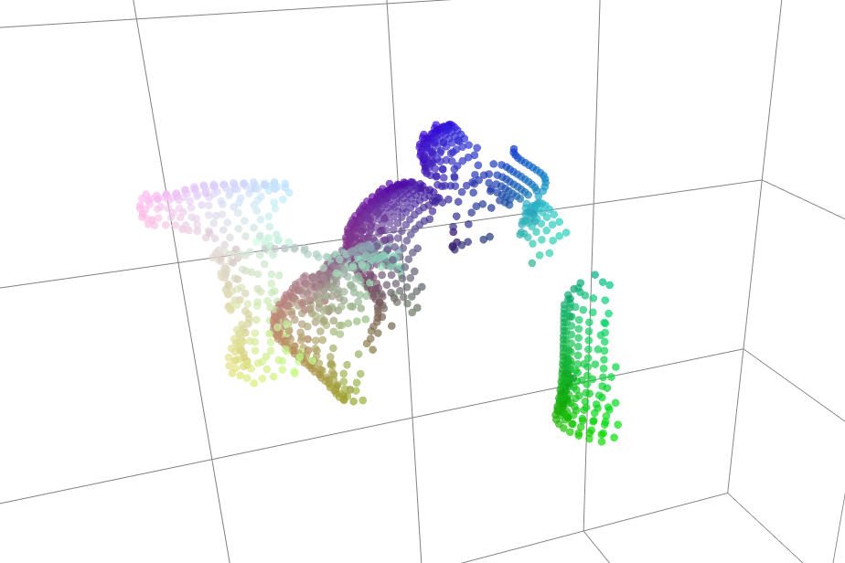
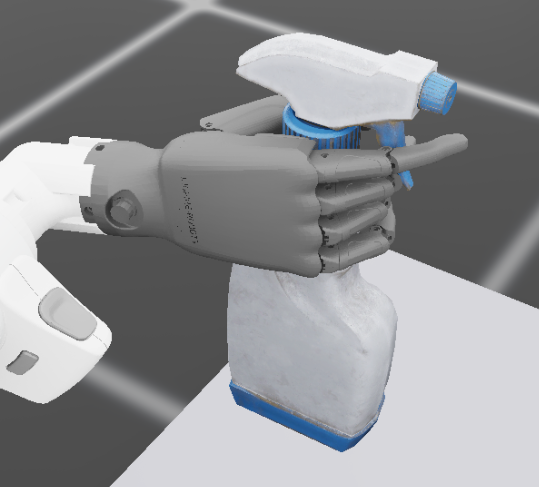
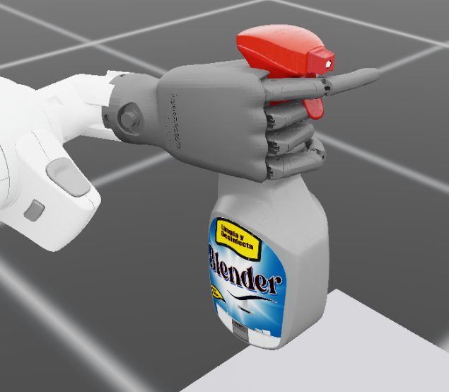
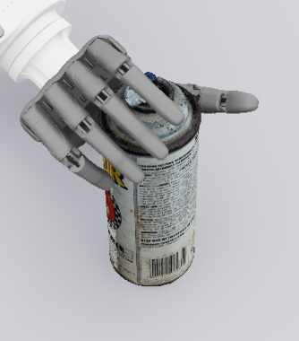
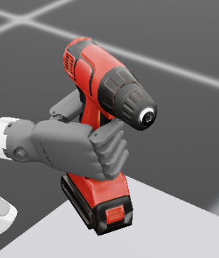
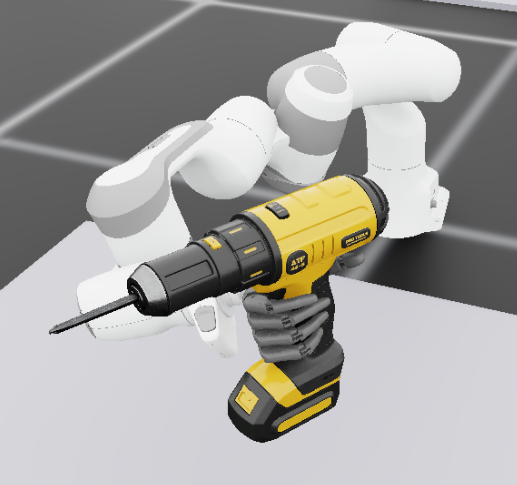
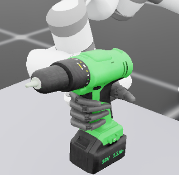

# Learning-based Functional Grasping for Dexterous Hands

**Master's thesis · Technical University of Munich (TUM)**<br>
Supervisors: Qian Feng, Zitao Zhang

Isaac Lab environments and a teacher–student learning pipeline for functional grasping of power
drills with a 7-DoF Franka arm and a 6-DoF Inspire hand. A functional grasp encloses the handle
while positioning the index finger near the trigger.

<p align="center"></p>
<p align="center"><em>One episode: reorient the drill on the table, form a functional grasp, then aim the bit at the work plate.</em></p>

## Method

A privileged PPO teacher learns grasping from a 74-dimensional simulator state and object-frame
functional targets. Successful rollouts train a
[3D Diffusion Policy](https://github.com/YanjieZe/3D-Diffusion-Policy) student using depth point
clouds, joint positions, and joint torques. An optional, separately trained PPO teacher performs
screw-hole alignment from successful grasp states.

The student combines **contact-gated torque features** with an auxiliary torque prediction
objective. In the default training configuration, a scalar gate predicted from joint torques
modulates the torque feature. Simulator hand–tool contact forces provide binary supervision
(threshold: 0.01 N; BCE weight: 0.1). Contact labels and functional annotations are used only during
training. All reported experiments are in simulation.

<p align="center"></p>

## Installation

Use two sibling checkouts:

```text
<workspace>/
├── dexterous-functional-grasping/   main: Isaac Lab training, collection, deployment
└── 3D-Diffusion-Policy/             dp3: student model and training code
```

Install Isaac Sim and Isaac Lab using the official
[installation guide](https://isaac-sim.github.io/IsaacLab/main/source/setup/installation/index.html).
This project was developed with Python 3.11 and Isaac Lab 0.53.1. In that environment:

```bash
# Repositories and dependencies
git clone https://github.com/Zeyu1-oss/dexterous-functional-grasping.git
git clone -b dp3 https://github.com/Zeyu1-oss/dexterous-functional-grasping.git 3D-Diffusion-Policy
cd dexterous-functional-grasping
pip install rl_games==1.6.1 zarr numcodecs dill omegaconf trimesh
pip install einops diffusers termcolor hydra-core gdown

# Assets
gdown --fuzzy 'https://drive.google.com/file/d/1PdrOZZjNwIF0OrMTwvL6x9sda6tw_FAN/view?usp=drive_link' -O assets.zip
unzip assets.zip -d assets/
python tools/build_robot_pointcloud.py
```

Released checkpoints are downloaded where they are used, in the sections below; each training step
can be skipped in favour of the checkpoint it would have produced.

Deployment runs in the Isaac Lab environment and imports model code from the `dp3` checkout.
For a different checkout location, set `DP3_ROOT` to its **inner** `3D-Diffusion-Policy/` directory
containing `diffusion_policy_3d`.
Student training requires a separate Python 3.8 environment; follow the `dp3` branch's
[installation instructions](https://github.com/Zeyu1-oss/dexterous-functional-grasping/blob/dp3/INSTALL.md)
and [training setup notes](https://github.com/Zeyu1-oss/dexterous-functional-grasping/tree/dp3#installation).

## Usage

Run commands from the `main` checkout in the Isaac Lab environment, except student training.

### Run the released student

```bash
# The distilled grasp student, trained by the pipeline below
gdown --fuzzy 'https://drive.google.com/file/d/19svkGp74ZOuaX3Tyom0twH36VG3Tywde/view?usp=drive_link' -O dp3_student.ckpt

python scripts/deploy_dp3_sim.py --stage1_only --headless --num_envs 70 \
    --single_camera --no_robot_pc --dp3_ckpt dp3_student.ckpt \
    --init_pose_file data/eval_sobol_100_pos010.npz --exam_n 100
```

This evaluates 100 poses per drill variant, 300 in total. The historical 79.7% result uses a weaker
success criterion than the current evaluation; see [Results](#results).

### Train the grasp policy

```bash
# 1. Train the PPO teacher
python scripts/train_with_rl_games.py --headless --num_envs 4096

# ...or skip step 1 and use the released grasp teacher
gdown --fuzzy 'https://drive.google.com/file/d/16oCxohqHhrrA1qDKqdP-CNuhHt1ARmvy/view?usp=sharing' -O stage1_teacher.pth
python scripts/play_drill.py --checkpoint stage1_teacher.pth        # optional: watch it grasp

# 2. Collect successful demonstrations
python scripts/collect_dp3_data.py --stage1_only --headless \
    --num_envs 256 --episodes_per_variant 1000 \
    --single_camera --no_robot_pc --force_state --save_contact \
    --stage1_checkpoint stage1_teacher.pth --output data/norobot.zarr
```

Activate the DP3 environment, then train the student with an absolute dataset path:

```bash
cd ../3D-Diffusion-Policy
bash scripts/train_policy_inspire_drill_grasp_norobot_eq1_auxtorque.sh \
    /absolute/path/to/dexterous-functional-grasping/data/norobot.zarr
```

Reactivate the Isaac Lab environment and evaluate the checkpoint:

```bash
cd ../dexterous-functional-grasping
python scripts/deploy_dp3_sim.py --stage1_only --headless --num_envs 70 \
    --single_camera --no_robot_pc \
    --dp3_ckpt ../3D-Diffusion-Policy/3D-Diffusion-Policy/data/outputs/<run>/checkpoints/epoch_0180.ckpt \
    --init_pose_file data/eval_sobol_100_pos010.npz --exam_n 100
```

Ablation scripts are in the `dp3` checkout's `scripts/` directory
(`..._norobot_baseline.sh`, `..._torqueobs.sh`, `..._torqueobj.sh`, `..._eq1.sh`).
Use the same demonstration dataset and evaluation protocol for each condition.

The point cloud is assembled from two sources, and the two flags above select what the released
student was trained on: `--single_camera` builds it from cam1 alone, and `--no_robot_pc` leaves out
the forward-kinematics robot points. Its state vector is joint positions and torques.

> **Observation consistency:** collection and deployment must use matching camera and robot-cloud
> settings. Shape checks do not detect all composition mismatches.

<details>
<summary>Camera and robot-cloud options</summary>

| Flag | Function |
|---|---|
| `--single_camera` | Build the camera segment from cam1 alone, rather than fusing cam1 and cam2 at half the budget each |
| `--no_robot_pc` | Omit the robot segment; the point cloud is the camera segment alone |
| `--robot_pc_points` | Set the robot-segment point budget |
| `--robot_pc_hand_only` | Restrict the robot segment to hand links |
| `--robot_pc_per_link` | Set the per-link point allocation |

The robot segment supplements the camera cloud with canonical robot-link points placed by forward
kinematics, which the depth view resolves poorly once the fingers close. cam2 is the wrist camera
under `--chained` and `--stage2_only`, and a second fixed view under `--stage1_only`.

Pass these settings explicitly during collection and deployment: their defaults differ, and
changing the link filter may preserve the array shape while changing its content.

<p align="center"></p>

</details>

### Optional alignment stage

Train a separate alignment teacher from successful grasp states:

```bash
python scripts/collect_success_data.py --headless --num_envs 4096 \
    --checkpoint stage1_teacher.pth --output collected_data/success_data.pkl
python scripts/train2.py --headless --num_envs 4096 --dataset collected_data/success_data.pkl
python scripts/play_stage2.py --checkpoint <alignment_ckpt>
```

For combined deployment, use `--stage2_rl` for teacher alignment or `--stage2_dp3_ckpt` for a
separately distilled alignment student. This stage is independent of the grasp ablation.

<p align="center"></p>

## Results

The standard evaluation uses the fixed Sobol pose set `data/eval_sobol_100_pos010.npz`
(100 poses per variant), generated independently of the teacher. Grasp success requires:

- Index fingertip within 3 cm of the annotated trigger point.
- At least 5–6 hand links, depending on the variant, in contact above 0.1 N.
- Thumb distal link within 3 cm of its target, where specified.

These conditions must hold for at least **20 steps within a rolling 50-step window**.
The metric measures grasp configuration and trigger proximity; the trigger is not actuated.

Historical teacher success rates are **93.0%** for grasping and **92.0%** for alignment.
Their evaluation logs were not retained, so their protocols cannot be verified against the
student evaluation below.

<p align="center">
  
  
  
  
  
  
</p>
<p align="center"><em>Terminal configurations reached by grasp students. The first four are instances
from the trained categories — two trigger sprays, a thumb-actuated dispenser, a drill. The last two
are drill instances held out from training.</em></p>

The tools beyond drills are the same formulation under different per-object annotations — what
changes is where the control sits and which digit actuates it, not the policy or the reward. The
active configuration here is three drills (`drill2`, `drill_blue`, `drill_yellow`); the spray and
can variants are present in [config/drill_variants.yaml](config/drill_variants.yaml) but commented
out, and [docs/ADDING_OBJECTS.md](docs/ADDING_OBJECTS.md) covers annotating a new object.

### Torque ablation

All students use point clouds and joint positions. “Observation” and “Target” refer to torque.

| Configuration | Observation | Target | Gate | Success |
|---|:--:|:--:|:--:|--:|
| Baseline | | | | 70.3% |
| Torque observation | ✓ | | | 74.3% |
| Torque target | | ✓ | | 69.7% ‡ |
| Observation + target | ✓ | ✓ | | 73.3% ‡ |
| Observation + gate | ✓ | | ✓ | 78.3% † |
| Observation + gate + target | ✓ | ✓ | ✓ | 79.7% † |

**Evaluation differences:** † uses success in any single step instead of the 20-in-50 criterion;
‡ uses teacher-solved poses instead of the Sobol set. Unmarked rows use the standard protocol.
Results are from one training seed, selecting the best of 6–13 evaluated epochs per condition;
records are in [results/success_rates.csv](results/success_rates.csv).
**These values are not directly comparable.** A uniform reevaluation is required before attributing
improvements to gating or reporting statistical significance. Use `--dump_exam` to retain per-pose
outcomes for paired comparisons.

<p align="center"></p>

On unseen drill geometries, grasps often satisfy the contact criterion but fail trigger proximity.
Annotation error is an unverified explanation; held-out trigger locations require validation before
separating annotation effects from policy generalization failures.

## Repository Layout

```text
tasks/          Isaac Lab environments, rewards, and termination conditions
scripts/        Training, visualization, collection, and deployment
perception/     Shared point-cloud and observation processing
config/         Scene, object-variant, and agent configurations
tools/          Asset preparation, evaluation, and analysis
results/        Evaluation records and plots
data/           Generated datasets and the committed evaluation pose set
```

Assets, datasets, and training outputs are generally gitignored. For new objects, see
[docs/ADDING_OBJECTS.md](docs/ADDING_OBJECTS.md). For evaluation sweeps and diagnostics, use
`tools/sweep_eval.py` and deployment flags `--policy rl`, `--dump_gate`, and `--dump_torque`.

## References

- Ze et al., **3D Diffusion Policy**, RSS 2024 — student architecture.
- He et al., **FoAR: Force-Aware Reactive Policy**, RA-L 2025
  ([arXiv:2411.15753](https://arxiv.org/abs/2411.15753)) — contact-aware feature fusion.
- Lei et al., **Learning When to See and When to Feel**
  ([arXiv:2604.01414](https://arxiv.org/abs/2604.01414)) — vision–torque fusion.
- Zhang et al., **TA-VLA**
  ([arXiv:2509.07962](https://arxiv.org/abs/2509.07962)) — torque observations and auxiliary targets.
